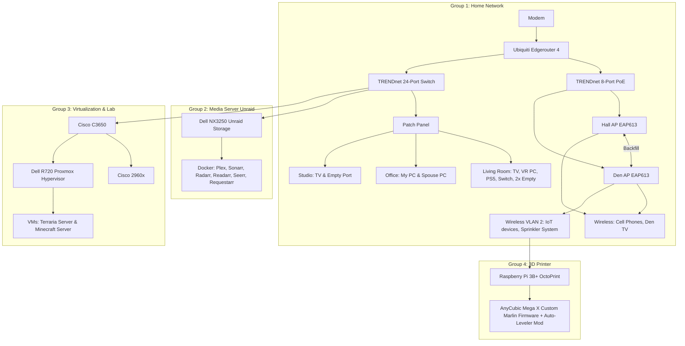

```mermaid
flowchart TD
    subgraph G1 [Group 1: Home Network]
        Modem[Modem] --> Router[Ubiquiti Edgerouter 4]
        
        Router --> Trend8[TRENDnet 8-Port PoE]
        Router --> Trend24[TRENDnet 24-Port Switch]
        
        Trend8 --> HallAP[Hall AP EAP613]
        Trend8 --> DenAP[Den AP EAP613]
        
        HallAP <-->|Backfill| DenAP
        
        HallAP --> Wireless1[Wireless: Cell Phones, Den TV]
        DenAP --> Wireless1
        DenAP --> WirelessVLAN2[Wireless VLAN 2: IoT devices, Sprinkler System]
        
        Trend24 --> Patch[Patch Panel]
        
        Patch --> LivingRoom[Living Room: TV, VR PC, PS5, Switch, 2x Empty]
        Patch --> Office[Office: My PC & Spouse PC]
        Patch --> Studio[Studio: TV & Empty Port]
    end

    subgraph G2 [Group 2: Media Server Unraid]
        DellStorage[Dell NX3250 Unraid Storage] --> Docker[Docker: Plex, Sonarr, Radarr, Readarr, Seerr, Requestarr]
    end

    subgraph G3 [Group 3: Virtualization & Lab]
        Cisco3650[Cisco C3650] --> Cisco2960x[Cisco 2960x]
        Cisco3650 --> DellHypervisor[Dell R720 Proxmox Hypervisor]
        DellHypervisor --> VMs[VMs: Terraria Server & Minecraft Server]
    end

    subgraph G4 [Group 4: 3D Printer]
        Pi[Raspberry Pi 3B+ OctoPrint] --> Printer[AnyCubic Mega X Custom Marlin Firmware + Auto-Leveler Mod]
    end

    %% Inter-group connections
    Trend24 --> DellStorage
    Trend24 --> Cisco3650
    WirelessVLAN2 --> Pi
```
